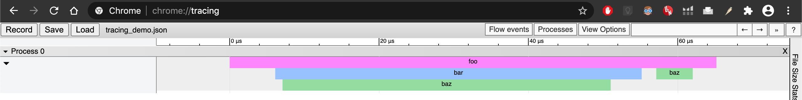

# Rust `timed` macro to quickly profile your programs

✅ Works with `async`

✅ Works with `main`

✅ Custom printers, like `println!`, `info!`, or your own function.

✅ New! Profile your program with chrome tracing, build a flamegraph.

### Usage `duration`

```toml
[dependencies]
timed = "0.1.5"
log = "0.4"
```

```rust
use timed::timed;
#[macro_use] extern crate log;

#[timed]
fn add(x: i32, y: i32) -> i32 { x + y }

#[timed]
fn mul(x: i32, y: i32) -> i32 { x * y }

#[timed(printer = "println!")]
fn mul_println(x: i32, y: i32) -> i32 { x * y}

#[timed(printer = "info!")]
fn mul_info(x: i32, y: i32) -> i32 { x * y }


#[test]
fn timing() {
    assert_eq!(add(1, 2), 3);
    assert_eq!(mul(1, 2), 2);
    assert_eq!(mul_println(1, 2), 2);
    assert_eq!(mul_info(1, 2), 2);
}
```


Output:

```
$ cargo test -- --nocapture
running 1 test

function=add duration=36ns
function=mul duration=36ns
function=mul_println duration=31ns
 INFO  demo_duration > function=mul_info duration=326ns

test timing ... ok
```

Also works with main and tokio:

```rust
#[tokio::main]
#[timed]
async fn main() {
    println!("Running main");
    reqwest::get("https://google.com").await;
}
```

Output:

```
Running main
Calling https://type.fit/api/quotes
Quote of the day: 
Genius is one percent inspiration and ninety-nine percent perspiration. - Thomas Edison
function=get_random_quote duration=455.291753ms
function=main duration=456.452412ms
```

### Usage chrome::tracing

```rust
#[timed::timed(tracing = true)]
fn foo() {
    bar();
    baz();
}

#[timed::timed(tracing = true)]
fn baz() {
    println!("Hello")
}

#[timed::timed(tracing = true)]
fn bar() {
    baz();
}

#[timed::timed(tracing = true)]
fn main() {
    timed::init_tracing!(
        "Main", 
        TraceOptions::new()
        .with_chrome_trace(|x: &str| println!("{}", x)).build()
    );
    foo();
}

```

```shell script
Hello
function=baz duration=27.264µs
function=bar duration=45.606µs
Hello
function=baz duration=1.625µs
function=foo duration=57.556µs
[
    { "pid": 0, "ts": 1603026625248670,  "ph": "B", "name": "foo" },
    { "pid": 0, "ts": 1603026625248676,  "ph": "B", "name": "bar" },
    { "pid": 0, "ts": 1603026625248677,  "ph": "B", "name": "baz" },
    { "pid": 0, "ts": 1603026625248721,  "ph": "E", "name": "baz" },
    { "pid": 0, "ts": 1603026625248725,  "ph": "E", "name": "bar" },
    { "pid": 0, "ts": 1603026625248727,  "ph": "B", "name": "baz" },
    { "pid": 0, "ts": 1603026625248732,  "ph": "E", "name": "baz" },
    { "pid": 0, "ts": 1603026625248735,  "ph": "E", "name": "foo" }
]

```

Save the json dump between `[` and `]` to file `tracing.json` then open in Chrome `chrome://tracing` and drag the file:


## Contribution
Contributions are welcome. Please submit PR.
See [TODO](TODO.md)

### Run / Build

To build specific packages / examples / binaries, follow the usual workflow. To do a full build on everything, run the below:

```shell script
$ cargo make
$ cargo make testing
```